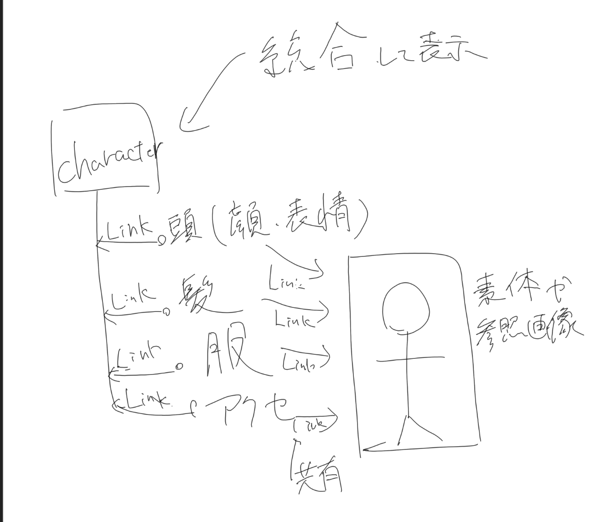

# Character.blend統合構成の関係表作成

- Status: done
- Priority: P2
- Type: feature
- Source: local
- Draft source: codex-cli
- Phase: 03-design
- Created: 2026-05-16
- QCDS: Quality, Cost, Satisfaction

## Context

添付画像のように、Character.blendで髪、表情、服、アクセ、素体を統合表示し、頭、表情、服、アクセを個別編集する構成を今回開発したBlenderアドオンで実現するため、各.blendファイル間の参照関係、編集責務、Link管理対象を整理した関係表を作成する。素体用Blendファイルは頭、表情、服、アクセから参照される前提とし、Link管理、部位レジストリ、検証レポートの責務を混在させない。ユースケースとしてユーザに示せるよう、既存ドキュメントへの追記または関連ドキュメント整備も対象とする。

## Acceptance Criteria

- [x] Character.blend、素体、頭、表情、服、アクセの各Blendファイルの役割と参照方向が関係表として整理されている
- [x] 素体用Blendファイルが頭、表情、服、アクセから参照される関係が明示されている
- [x] 各部位ファイルで編集する対象と、Character.blend側で統合表示する対象が区別されている
- [x] 今回開発したアドオンで扱うLink管理、部位レジストリ、検証レポート上の扱いが関係表に反映されている
- [x] ユーザ向けユースケースとして既存ドキュメントへの追記または関連ドキュメント整備が完了している

## Attachments

## Notes

- 2026-05-17: `docs/character-blend-relationship.md` を追加し、Character.blend、base body、頭 / 表情、髪、服、アクセサリの役割、参照方向、編集責務、Part Registry / Link 管理 / 検証レポート上の扱いを整理した。
- 2026-05-17: README、AGENTS、SKILL、requirements、specification、features、user guide、design、architecture、implementation-plan、test-plan、manual-test、QCDS、release evidence、TODO、Issues index を同期した。

## Codex Sessions

- 2026-05-16T21:12:28.646Z `codex-session-20260516211228-jkksch` - All Work Items (VS Code Codex handoff); access=danger-full-access; model=gpt-5.5; intelligence=xhigh; [prompt](c:/Users/gkkjh/AppData/Roaming/Code/User/workspaceStorage/915f2e6b3223925d61deb8335d66d110/sunmax0731.codex-friendly-project-starter/first-prompt-20260516T211228Z.md)
