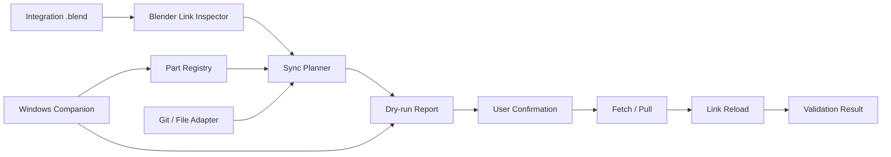

# アーキテクチャ

## 基本方針

Blender Link 操作、部位レジストリ、外部同期、検証レポートを分ける。UI は operator の入口に留め、実処理はテスト可能な core と adapter に置く。

## Options

| Option | 概要 | 強み | 弱み | 判定 |
| --- | --- | --- | --- | --- |
| A | Blender アドオン内に core と sync adapter を持つ | 導入が簡単で Blender 内で完結する | 長時間処理で UI 負荷に注意が必要 | MVP 採用 |
| B | 外部常駐アプリが Git / file sync を担当し Blender は表示だけ行う | 大規模チームや長時間処理に強い | installer と常駐権限が必要 | Deferred |
| C | Git hooks と手順書だけで運用する | 実装が少ない | Blender Link 状態を検出できず利用者負荷が高い | 不採用 |

MVP は Option A を採用する。処理が重くなる場合は adapter 実行を worker に逃がし、将来 Option B へ移行できる contract を保つ。

## Module Boundary

| Layer | Responsibility |
| --- | --- |
| `ui` | パネル、operator、ユーザー確認、結果表示、Blender 表示言語に従う UI 翻訳 |
| `core.registry` | part registry の読み書き、schema validation、tag 正規化、GUI 候補生成の安全な初期値 |
| `core.plan` | status classification、sync plan 作成、risk 判定 |
| `adapters.git` | Git status / fetch / pull / push preview |
| `adapters.local` | 共有フォルダやローカル mirror の存在確認とコピー計画 |
| `blender.link` | linked library 検出、Link 追加前の collection / object / source linked library inspection、collection checkbox 選択の複数 Link、indirect linked library report、object type 分類、production target 推奨、非 3D model object の明示 Link、reload、linked datablock local 化、broken link レポート |
| `report` | JSON / Markdown レポート、QCDS / release evidence 連携 |
| `windows` | Blender 外の registry 検証、設定保存、installer dry-run |
| `scripts` | docs、unit test、runtime gate、release package 検証 |

## Character Production Topology

`Character.blend` の統合構成は [Character.blend 統合構成の関係表](character-blend-relationship.md) を正本にする。`blender.link` は `Character.blend` が直接参照する linked library / collection / object を扱い、`core.registry` は部位ごとの管理行を保持し、`report` は素体参照のような部位間依存を確認事項として出す。素体依存を hidden transitive reload として自動処理しないことで、Link 管理、部位レジストリ、検証レポートの責務を分ける。

## Data Flow

## Failure Policy

- `local-dirty` と `conflict-risk` は自動更新しない。
- `broken-link` は registry と Blender 側 Link の両方を表示し、ユーザーに修正候補を選ばせる。
- adapter 実行失敗時は `.blend` を保存せず、result JSON に終了コード、標準エラー要約、対象部位を残す。
- scheduled pull は MVP 後とし、まず manual / batch 操作を安定させる。
- Windows companion は `.blend` を開かず、設定保存と registry preview に限定する。
- GUI registry editing は `core.registry` の候補生成を使い、Blender session への Link は `blender.link` の明示操作に閉じ込める。外部 sync と registry 編集を同じ operator に混ぜない。
- linked file 統合は `blender.link.integrate_linked_libraries` に閉じ込め、UI は選択 part、確認ダイアログ、report 保存だけを担当する。
